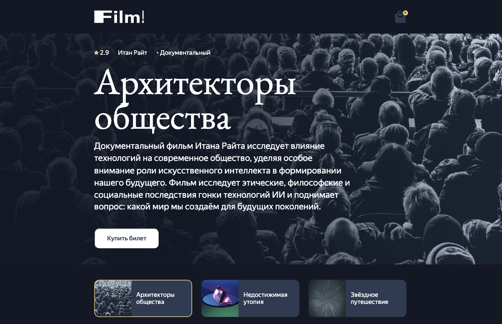

# Проект FILM!

Доступен по адресу [https://film.productmap.ru/](https://film.productmap.ru/)

## Описание проекта

В мире, переполненном информацией и бесконечным выбором, "FILM!" — это не просто очередное приложение для поиска фильмов. Это ваш персональный проводник в мире кинематографа, компас, указывающий путь к историям, которые затронут струны вашей души. Мы верим, что каждый фильм — это возможность прожить еще одну жизнь, испытать новые эмоции и, возможно, найти ответы на вопросы, которые вы даже не решались задать. "FILM!" помогает вам не просто выбрать, что посмотреть, а совершить маленькое путешествие вглубь себя через магию кино.

## Стек технологий

* **Frontend**: React
* **Backend**: NestJS, MongoDB / Postgres
* **DevOps**: Docker, Yandex Cloud

## Документация

* [Локальный запуск в Docker](doc/local_docker_deployment.md)
* [Разворачивание приложения в Яндекс Облаке](doc/yandex_cloud_deployment.md)
